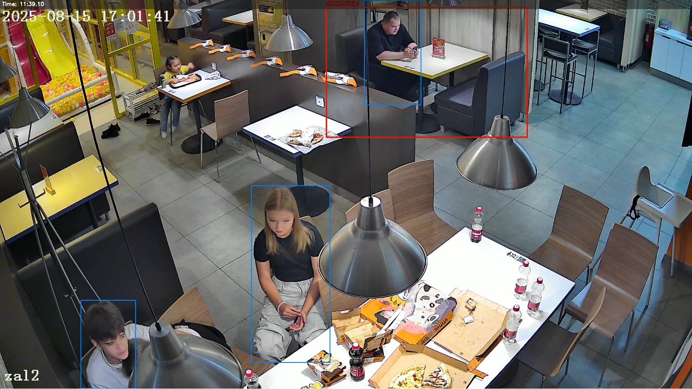
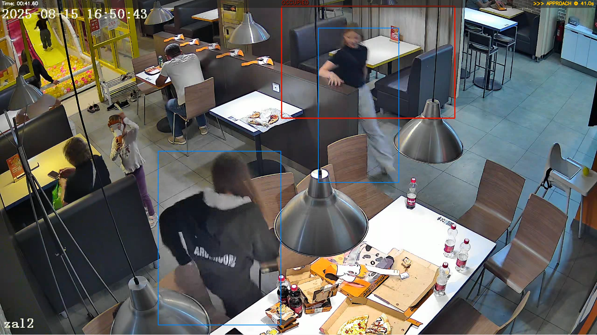

# Прототип системы детекции уборки столиков

Упрощённый, но рабочий пайплайн на Python для анализа одного столика в ресторане/кафе по видеозаписи.

---

### Старт приложения
1. Установить зависимости (в случае использования uv `uv sync`)

```bash
pip install -e .
```

2. Настроить переменные окружения в файле `.env` (опционально)

3. Запустить скрипт

```bash
python dodocv/main.py --video path/to/video.mp4
```

После запуска откроется окно - **выделите зону столика мышью** и нажмите `enter`/`space`.
> Для теста было выбрано первое видео, конкретный столик показан на скриншоте в конце отчета.
---

### Выходные файлы

| Файл | Описание |
|------|----------|
| `output.mp4` | Видео с визуализацией |
| `events.csv` | Таблица всех событий с временными метками |
| `report.txt` | Текстовый отчёт со статистикой задержек |

> Или другой путь, если он указан в `.env`
---

### Логика детекции событий
1. Поступает кадр
2. YOLOv8n детектирует всех людей (class = person, conf ≥ 0.40)
3. Проверяем условие:
   - есть ли хотя бы один bbox человека, у которого
     - центр внутри ROI
     или
     - IoU(bbox, ROI) ≥ 10%
4. Если ДА:
   - occupied_streak += 1
   - проверяем: occupied_streak ≥ 8
     - если да:
       - если state == "empty":
         - state = "approach"
         - затем state = "occupied"
5. Если НЕТ:
   - empty_streak += 1
   - проверяем: empty_streak ≥ 20
     - если да:
       - state = "empty"
       - записать метку времени

### Три состояния

| Состояние | Цвет рамки | Условие |
|-----------|----------|---------|
| `empty` | Зелёный | 20 подряд кадров без человека в ROI |
| `approach` | Жёлтый | Первое появление человека после «empty» |
| `occupied` | Красный | Человек присутствует в ROI |

---

### Аналитика

Для каждого события `approach` фиксируется:
- `timestamp` - секунды от начала видео
- `delay_after_empty` - время (сек) между событием `empty` и данным `approach`

**Итоговая статистика (пример):**

```
Среднее время реакции (уход → следующий подход): X.XX s
Медиана: X.XX s   |   Мин: X.XX s   |   Макс: X.XX s
```

---

## Примеры кадров
Занятый столик:
<p align="center">
  
</p>

Проблемный кадр - просто проход клиента около столика считается как занятие столика:
<p align="center">
  
</p>

Аналитика и отчет представлены в папке `/results`.  
[Ссылка](https://drive.google.com/file/d/1NMJRhZanAl3zdyKRS6QdhXSpcytJ3avS/view?usp=sharing) на гугл диск с итоговым видео